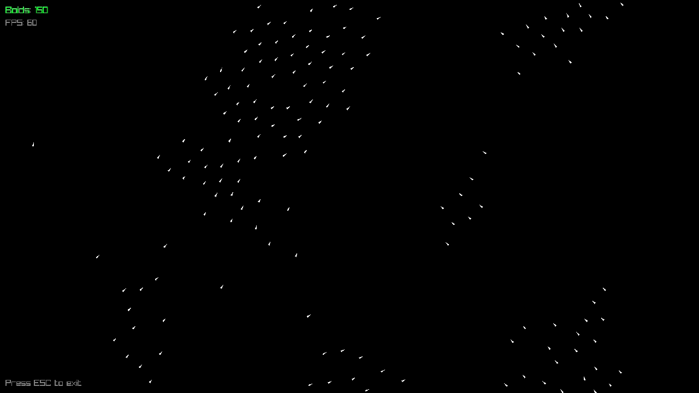

# C++ Boids Flocking Simulation 🐦

An interactive, high-performance 2D flocking simulation built from scratch using modern C++17 and the Raylib library. 

 

> **Note**: This project demonstrates the practical application of emergent behavior algorithms, modern C++ memory management, and data-oriented design.

## 🚀 Features

* **Emergent Behavior**: Implements the classic Boids algorithm (Separation, Alignment, Cohesion) with mathematically tuned physical parameters for fluid, life-like movement. Features anti-jitter math (Epsilon) and smooth steering limiters.
* **Modern C++ Architecture**: Fully decoupled multi-file structure. Physics update logic and graphics rendering logic are strictly separated into dedicated modules.
* **Performance Optimized**: Built with CPU Cache efficiency in mind. Utilizes Data Locality through flat `std::vector` contiguous memory allocation, avoiding pointer overhead and maximizing Cache Hit Rates.
* **Safe Memory Management**: Follows strict RAII principles without manual `new`/`delete` or raw owning pointers.
* **Cross-Platform Build**: Managed entirely by modern CMake using `FetchContent` for automated dependency resolution.

## 🛠️ Build Instructions

This project uses CMake's `FetchContent` to automatically download and statically link Raylib. No manual library installation or environment variable configuration is required.

### Prerequisites
* C++17 Compiler (MSVC, MinGW-w64, or GCC/Clang)
* CMake (3.15 or higher)

### Build Steps

```bash
# 1. Clone the repository
git clone [https://github.com/wyx-eason/boids-cpp-simulation.git](https://github.com/wyx-eason/boids-cpp-simulation.git)
cd boids-cpp-simulation

# 2. Generate build files
cmake -B build

# 3. Compile the project
cmake --build build --config Release

# 4. Run the executable (Windows)
./build/bin/Release/cgame.exe
```

🧠 Architecture Notes
While the current mathematical complexity for the neighborhood search is O(N^2), the data layout is specifically designed to be highly cache-friendly to brute-force the performance bottleneck.

Future optimizations will include Uniform Grid Spatial Partitioning to reduce the neighborhood search complexity from O(N^2) down to O(N), paving the way for simulating tens of thousands of boids at 60 FPS using multi-threading.

Author: Wang Yixun